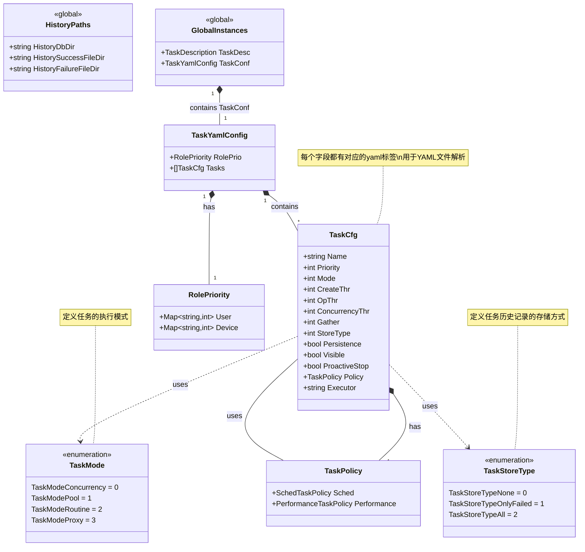
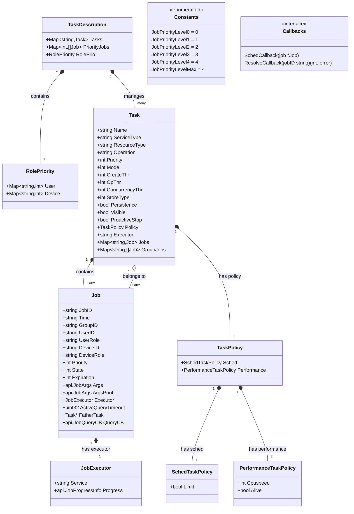

## conf.go

```mermaid

classDiagram
    %% Enums
    class TaskMode {
        <<enumeration>>
        TaskModeConcurrency = 0
        TaskModePool = 1
        TaskModeRoutine = 2
        TaskModeProxy = 3
    }

    class TaskStoreType {
        <<enumeration>>
        TaskStoreTypeNone = 0
        TaskStoreTypeOnlyFailed = 1
        TaskStoreTypeAll = 2
    }

    %% Global Variables
    class HistoryPaths {
        <<global>>
        +string HistoryDbDir
        +string HistorySuccessFileDir
        +string HistoryFailureFileDir
    }

    %% Main Configuration Structures
    class TaskYamlConfig {
        +RolePriority RolePrio
        +[]TaskCfg Tasks
    }

    class TaskCfg {
        +string Name
        +int Priority
        +int Mode
        +int CreateThr
        +int OpThr
        +int ConcurrencyThr
        +int Gather
        +int StoreType
        +bool Persistence
        +bool Visible
        +bool ProactiveStop
        +TaskPolicy Policy
        +string Executor
    }

    %% Global Instances
    class GlobalInstances {
        <<global>>
        +TaskDescription TaskDesc
        +TaskYamlConfig TaskConf
    }

    %% External Types from model package
    class RolePriority {
        +Map~string,int~ User
        +Map~string,int~ Device
    }

    class TaskPolicy {
        +SchedTaskPolicy Sched
        +PerformanceTaskPolicy Performance
    }

    %% Relationships
    TaskCfg ..> TaskMode : uses
    TaskCfg ..> TaskStoreType : uses
    TaskYamlConfig "1" *-- "*" TaskCfg : contains
    TaskYamlConfig "1" *-- "1" RolePriority : has
    TaskCfg "1" *-- "1" TaskPolicy : has
    GlobalInstances "1" *-- "1" TaskYamlConfig : contains TaskConf
    TaskCfg -- TaskPolicy : uses

    %% Notes
    note for TaskCfg "每个字段都有对应的yaml标签\n用于YAML文件解析"
    note for TaskMode "定义任务的执行模式"
    note for TaskStoreType "定义任务历史记录的存储方式"
```

## model.go

```mermaid
classDiagram
    class TaskDescription {
        +Map~string,Task~ Tasks
        +Map~int,[]Job~ PriorityJobs
        +RolePriority RolePrio
    }

    class RolePriority {
        +Map~string,int~ User
        +Map~string,int~ Device
    }

    class Task {
        +string Name
        +string ServiceType
        +string ResourceType
        +string Operation
        +int Priority
        +int Mode
        +int CreateThr
        +int OpThr
        +int ConcurrencyThr
        +int StoreType
        +bool Persistence
        +bool Visible
        +bool ProactiveStop
        +TaskPolicy Policy
        +string Executor
        +Map~string,Job~ Jobs
        +Map~string,[]Job~ GroupJobs
    }

    class TaskPolicy {
        +SchedTaskPolicy Sched
        +PerformanceTaskPolicy Performance
    }

    class SchedTaskPolicy {
        +bool Limit
    }

    class PerformanceTaskPolicy {
        +int Cpuspeed
        +bool Alive
    }

    class Job {
        +string JobID
        +string Time
        +string GroupID
        +string UserID
        +string UserRole
        +string DeviceID
        +string DeviceRole
        +int Priority
        +int State
        +int Expiration
        +api.JobArgs Args
        +api.JobArgs ArgsPool
        +JobExecutor Executor
        +uint32 ActiveQueryTimeout
        +Task* FatherTask
        +api.JobQueryCB QueryCB
    }

    class JobExecutor {
        +string Service
        +api.JobProgressInfo Progress
    }

    TaskDescription "1" *-- "many" Task : manages
    TaskDescription "1" *-- "1" RolePriority : contains
    Task "1" *-- "many" Job : contains
    Task "1" *-- "1" TaskPolicy : has policy
    TaskPolicy "1" *-- "1" SchedTaskPolicy : has sched
    TaskPolicy "1" *-- "1" PerformanceTaskPolicy : has performance
    Job "1" *-- "1" JobExecutor : has executor
    Job "many" --o "1" Task : belongs to

    %% Constants
    class Constants {
        <<enumeration>>
        JobPriorityLevel0 = 0
        JobPriorityLevel1 = 1
        JobPriorityLevel2 = 2
        JobPriorityLevel3 = 3
        JobPriorityLevel4 = 4
        JobPriorityLevelMax = 4
    }

    %% Add callback types
    class Callbacks {
        <<interface>>
        SchedCallback(job *Job)
        ResolveCallback(jobID string) (int, error)
    }

```

